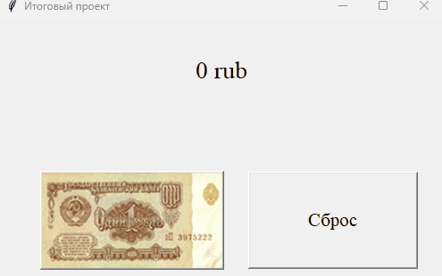
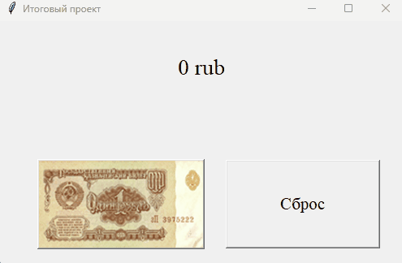

## Итоговый проект. №11
  - ### Цель проекта
    Написать свою игру "*кликер*" и воспользоваться AHK для автоматизации действия в игре.
  - ### Требования к проекту
    1. Создайте файл kliker.py и реализуйте в нем следующие функции:
        1. Вывести начальное количество рублей
        2. Добавить кнопку "*Клик*" при нажатии на которую будет увеличиваться количество рублей
        3. Добавить кнопку "*Сброс*", которая будет сбрасывать счетчик
    2. Создайте файл mouse.ahk и реализуйте в нем следующие функции:
        1. Скрипт запускается и останавливается при нажатии на клавишу Numpad1.
        2. Реализовать клик мышки при включении скрипта, мышь будет кликать до повторного нажатия Numpad1
  - ### Результат
    Рабочий кликер с автоматическим нажатием кнопки
  - ### Советы и рекомендации по выполению
    Для выполнения задания, используйте полученные знания и навыки из предыдущих уроков.
  - ### Критерии оценивания
    К1 - Проект создан и запускается  
    К2 - Проект создани и не полностью выполняется хотя бы одна задача из поставленных  
    К3 - Проект создан и выполняется одна задача из поставленных, без ошибок и сбоев  
    К4 - Проект создан и выполняется большая часть задач из поставленных, с небольшими ошибками  
    К5 - Проект создан и выполняются все задачи из поставленных, без сбоев и ошибок  

## Примеры ввода/вывода 
  | Ввод  | Вывод |
  |:------------------------:|:---------------:|
  | 12 кликов |  |
  | *использование скрипта mouse.ahk*   (нажатие Numpad1)   нажатие кнопки сброса|  |

## Алгоритмы решения
### Решение скоро будет :)
