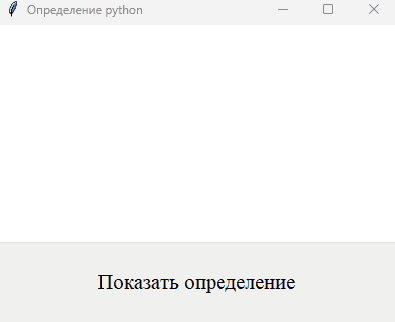
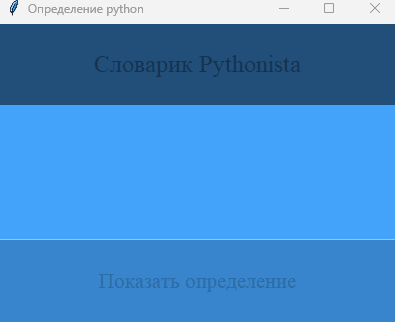

## Практические задания для самостоятельного выполнения Обзорная лекция. №10
```py
definitions = {
    "While": "Цикл 'while' используется для выполнения блока кода, пока условие истинно.",
    "For": "Цикл 'for' используется для итерации по элементам последовательности (например, списку или строке).",
    "If": "Условие 'if' позволяет выполнить определенный блок кода, если условие истинно.",
    "Function": "Функция - это блок кода, который можно вызывать с определенными аргументами.",
    "List": "Список - это упорядоченная коллекция элементов, которая может содержать разные типы данных."
}
```
- ### Начальный уровень
  - #### Задание №1
    Напишите программу с GUI, используя библиотеку tkinter, которая будет выводить случайные определения (из словаря, данного выше) по нажатию кнопки

- ### Базовый уровень
  - #### Задание №1
     Напишите программу с GUI, используя библиотеку tkinter, которая будет выводить случайные определения (из словаря, данного выше) по нажатию кнопки. <br> Сделайте дизайн приложения (к примеру- сделайте заголовок внутри окна). 


## Примеры ввода/вывода 
- ### Начальный уровень
  - #### Задание №1
    | Ввод  | Вывод |
    |:------------------------:|:---------------:|
    | Несколько нажатий <br> на кнопку "Показать определение" |  |
- ### Базовый уровень
  - #### Задание №1
    | Ввод  | Вывод |
    |:------------------------:|:---------------:|
    | Несколько нажатий <br> на кнопку "Показать определение" |  |

## Алгоритмы решения
- ### Скоро тут будет решение :)
